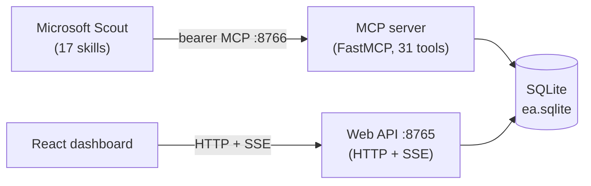

# Architecture

Two surfaces over one SQLite database.

## Backend (`backend/`)

- **Web API** — FastAPI on `:8765`. Serves the dashboard's HTTP endpoints, streams
  live updates over SSE, and handles control-loop writes. No auth (loopback-bound by default).
- **MCP server** — FastMCP, bearer-gated, on `:8766`. Scout's skills call it to read and
  write the database. Constant-time token check; SQL-injection-hardened whitelists.

Both processes share the **same SQLite file** (WAL mode, FTS5 full-text index rebuilt on demand).

## Frontend (`frontend/`)

React + TypeScript + Tailwind + shadcn, built to static assets and served by the API
inside the container. Talks to the API over HTTP and subscribes to SSE for live refresh.

## Skills (`skills/`)

17 `SKILL.md` automations — heartbeat scans and weekly tasks — pasted into Microsoft
Scout. They are the only writers that create signals, deadlines, trends, news, and
outgoing actions. See **[Skills](skills.md)** and the **[Setup Wizard](setup-wizard.md)**.

## Why two containers?

The web API and the MCP server run as **separate services** off one shared image and
one shared data volume. This isolates the bearer-gated MCP surface (which Scout reaches
over the network) from the loopback web dashboard, and lets each scale and restart
independently. See `docker-compose.yml`.

## Data flow

1. A skill fires on its schedule, reads its lookback window from `skill_runs`.
2. It scans email/Teams/calendar, dedupes by `external_ref`, and writes rows via MCP tools.
3. It ends by logging a `skill_runs` row (even on no-op) for observability.
4. The dashboard, polling `data_version` and listening on SSE, reflects the change live.
